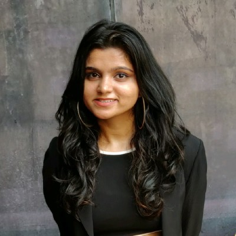

<!DOCTYPE html>
<html lang="en">
<head>
  <meta charset="UTF-8">
  <meta name="viewport" content="width=device-width, initial-scale=1.0">
  <title>Sakshee Sawant - Software Engineer</title>
  
</head>
<body>
  

    

      
      
Sakshee Sawant

    

    <a href="#about">About Me</a>
    <a href="#education">Education</a>
    <a href="#experience">Professional Experience</a>
    <a href="#projects">Projects</a>
    <a href="#skills">Skills</a>
    <a href="#contact">Contact</a>
    

      
      
      
    

  

  

    <section id="about">
      <h2>Hey there! 👋</h2>
      
I'm Sakshee, a passionate software engineer with a knack for turning complex data into meaningful insights and innovations. Originally from Mumbai, now navigating the vibrant tech scene in New York City while pursuing my Master's in Computer Engineering at NYU.

    </section>

    <section id="education">
      <h2>Education</h2>
      
<strong>New York University, NY</strong> Master’s in Computer Engineering (GPA: 3.6/4) 09/2023 – 05/2025

      
<em>Relevant Coursework:</em> Principles of Database Systems, Probability and Stochastic Processes, Machine Learning, Advanced Machine Learning, Deep Learning, Machine Learning for Cybersecurity, System Engineering

      
<strong>University of Mumbai, India</strong> Bachelor of Engineering in Computer Engineering (GPA: 9.47/10) 07/2018 – 05/2022

      
<em>Relevant Coursework:</em> Database Management System, Data Warehousing & Mining, Machine Learning, Software Engineering

    </section>

    <section id="experience">
      <h2>Professional Experience</h2>
      
<strong>Research Assistant, New York University</strong> 02/2024 – Present Contribute to research on pile bearing capacity and machine learning applications. Curate and preprocess large datasets, ensuring data quality, and assist in ML model development.

      
<strong>Data Engineering Associate, Accenture</strong> 09/2022 – 08/2023 Optimized data transformation and loading using ETL Informatica PowerCenter, improving performance by 22%. Streamlined data loading processes using SQL Server Management Studio (SSMS) and Salesforce.

      
<strong>Machine Learning Intern, Juppiter AI Labs</strong> 07/2022 – 09/2022 Developed an automated system for real estate agents using Deep Learning and Python, reducing manual effort by 45% and increasing productivity by 58%.

      
<strong>Backend Development Intern, Ifanow - Futurewise Technologies Pvt Ltd</strong> 08/2021 – 11/2021 Created APIs for email categorization and AWS S3 multipart uploads, enhancing system efficiency. Improved data retrieval times by 30% through SQL database updates.

      
<strong>Software Engineer Intern, VESIT Renaissance Cell</strong> 06/2021 – 08/2021 Developed "M-Vahitaram," an Android app for real-time crowd density information with a Firebase backend. Achieved 93% accuracy in crowd density prediction, leading to a publication in Springer's Proceedings of Emerging Trends and Technologies on Intelligent Systems.

    </section>

    <section id="projects">
      <h2>Projects That Fuel My Passion</h2>
      
<strong>Nirbhay Naari - AI for Empowerment</strong> Creating safe havens with AI-powered tools for women's safety, blending tech with compassion. This project is close to my heart, aiming to make a tangible impact in society.

      
<strong>Entrepôt Optimisé—Smarter Warehousing</strong> Redefining warehouse efficiency with a dash of AI and optimization. Improving logistics and reducing environmental impact are core goals of this project.

    </section>

    <section id="skills">
      <h2>My Toolbox 🛠️</h2>
      
<strong>Languages:</strong> Java, Python, SQL, JavaScript

      
<strong>Technologies:</strong> AWS, Django, Salesforce, Informatica PowerCenter, Android Studio

      
<strong>Tools:</strong> SQL Server Management Studio (SSMS), Git, TensorFlow, Keras

      
<strong>Methodologies:</strong> Machine Learning, Deep Learning, Data Warehousing, ETL, API Development

      
I'm passionate about staying ahead in technology trends and applying innovative solutions to real-world challenges.

    </section>

    <section id="contact">
      <h2>Let's Connect!</h2>
      
Feel free to drop me an email or connect via LinkedIn. Whether it's discussing tech, collaborating on projects, or just swapping stories, I'm always up for a chat!

      

        
        <a href="https://www.linkedin.com/in/saksh12"><i class='fab fa-linkedin' style='font-size:24px'></i>></a>
        <a href="https://github.com/saksheesawant215"><i class='fab fa-github-square' style='font-size:24px'></i></a>
      

    </section>
  

</body>
</html>
